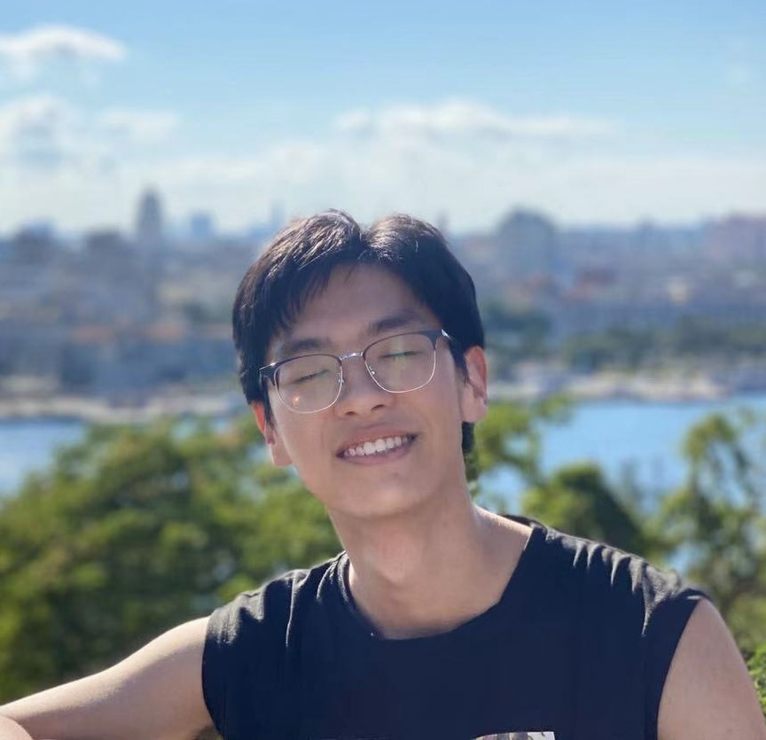

## Geng Li (李耕)

I am a second-year Ph.D. student at the Wangxuan Institute of Computer Technology, Peking University (PKU), advised by [Prof. Yuxin Peng](https://scholar.google.com/citations?hl=zh-CN&user=mFsXPNYAAAAJ&view_op=list_works&sortby=pubdate). My research focuses on Multimodal Large Language Models (MLLMs/LMMs), with a particular interest in fine-grained perception ([CVPR 2025 Highlight](publications/dyfo/) / [ICLR 2025](http://localhost:1313/publications/finedefics/)). I am also broadly interested in multimodal reasoning, LLM-based tool use, and embodied agents. Prior to joining PKU, I received both my Bachelor’s and Master’s degrees from Harbin Institute of Technology (HIT), where I worked with [Prof. Hongzhi Wang](https://homepage.hit.edu.cn/wang) on AutoML/Meta-learning. In the fall of 2020, I join a semester exchange program at Johns Hopkins University (JHU, at Maryland), thanks to the Honor School of HIT. 

Beyond research, I enjoy playing badminton and exploring the I Ching (周易).

<!-- - 📺 Demo: https://maverick.canhtran.me -->
- ❤️ Github: [ligeng0197](https://github.com/ligeng0197)
- 🎓 Google Scholar: [Geng Li](https://scholar.google.com/citations?user=0ufMJz4AAAAJ&hl=en)

<!-- Thanks in advance -->

<!--  -->
